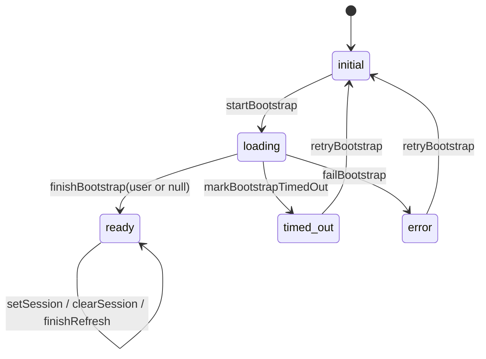

## Spec: App Shell and Auth Flow

**?좏삎**: `Feature`  
**?꾩튂**: `Clinet/features/app-shell-auth.md`  
**?묒꽦??*: 2026-03-28  
**?곹깭**: `Implemented`

---

### 紐⑹쟻

> ?쒗뭹??湲곕낯 吏꾩엯 援ъ“瑜?怨좎젙?쒕떎.  
> 怨듦컻 ?쇱슦?? 蹂댄샇 ?쇱슦?? ???? 濡쒓렇???붾㈃, ?몄뀡 蹂듦뎄 ?ㅽ뙣 ?€???먮쫫???섎굹??怨꾩빟?쇰줈 ?뺣━?쒕떎.

---

### ?쇱슦??踰붿쐞

```ts
type PublicRoute = '/' | '/login'
type ProtectedRoute =
  | '/dashboard'
  | '/curriculum'
  | '/curriculum/:id'
  | '/schedule'
  | '/habit'
  | '/analytics'
  | '/community'
  | '/community/:postId'
  | '/settings'
  | '/settings/billing'
```

---

### ?듭떖 ?붽뎄?ы빆

- [x] `/` ???몄쬆 ?곹깭???곕씪 `/dashboard` ?먮뒗 `/login` ?쇰줈 利됱떆 遺꾧린?쒕떎.
- [x] `/login` ?€ ?몄뀡???놁뼱??諛붾줈 ?뚮뜑留곷맂??
- [x] 蹂댄샇 ?쇱슦?몃뒗 `AuthGate` 濡?媛먯떬??
- [x] 蹂댄샇 ?쇱슦?몃뒗 ?몄뀡 蹂듦뎄 以묒씪 ??濡쒕뵫 ?붾㈃??蹂댁뿬以€??
- [x] 蹂댄샇 ?쇱슦?몃뒗 ?몄뀡 蹂듦뎄媛€ `timed_out` ?먮뒗 `error` 濡??앸굹硫??ъ떆??CTA瑜?蹂댁뿬以€??
- [x] ?몄쬆 ?ъ슜?먭? `/login` ???묎렐?섎㈃ `/dashboard` 濡??대룞?쒕떎.
- [x] 濡쒓렇?꾩썐 ???몄뀡???쒓굅?섍퀬 `/login` ?쇰줈 ?대룞?쒕떎.
- [x] `AppShell` ?€ ?ъ씠?쒕컮, ?섏씠吏€ ?쒕ぉ, ?≪뀡 ?щ’, 蹂몃Ц ?곸뿭???쒓났?쒕떎.

---

### ?곹깭 ?먮쫫



---

### ?붾㈃ ?숈옉 洹쒖튃

| 議곌굔 | ?숈옉 |
|------|------|
| `/` 吏꾩엯 + ?몄쬆??| `/dashboard` 濡??대룞 |
| `/` 吏꾩엯 + 鍮꾩씤利?| `/login` ?쇰줈 ?대룞 |
| `/login` 吏꾩엯 + ?몄쬆??| `/dashboard` 濡??대룞 |
| `/login` 吏꾩엯 + `timed_out`/`error` | 濡쒓렇???붾㈃ ?곷떒???ъ떆??諛곕꼫 ?몄텧 |
| 蹂댄샇 ?쇱슦??+ `initial`/`loading` | ?몄쬆 ?뺤씤 濡쒕뵫 移대뱶 ?몄텧 |
| 蹂댄샇 ?쇱슦??+ `timed_out`/`error` | ?ъ떆??濡쒓렇???대룞 CTA ?몄텧 |
| 蹂댄샇 ?쇱슦??+ `ready` + 鍮꾩씤利?| `/login` ?쇰줈 由щ떎?대젆??|

---

### ??auth transport 湲곗?

- ???대씪?댁뼵?몃뒗 `/api/v1/auth/web/login`, `/api/v1/auth/web/refresh`, `/api/v1/auth/web/logout` ???ъ슜?쒕떎.
- ???몄뀡 蹂듦뎄??same-site refresh cookie 瑜?湲곗??쇰줈 ?쒕떎.
- `/api/v1/auth/web/refresh` ??`401 REFRESH_SESSION_NOT_FOUND`, `401 REFRESH_SESSION_INVALID` ??auth service ?먯꽌 鍮꾨줈洹몄씤 ?곹깭濡??뺢퇋?뷀븳??
- ?곕씪???몄뀡 ?놁쓬?€ bootstrap error 媛€ ?꾨땲??`ready + isAuthenticated=false` ?곹깭濡??ロ엺??

---

### 援ы쁽 援ъ꽦

| ??ぉ | ?뚯씪 |
|------|------|
| 猷⑦듃 遺꾧린 | `src/features/auth/pages/RootRedirectPage.tsx` |
| ?몄쬆 遺€?몄뒪?몃옪 | `src/app/AuthBootstrap.tsx` |
| 蹂댄샇 ?쇱슦??媛€??| `src/features/auth/components/AuthGate.tsx` |
| 濡쒓렇???붾㈃ | `src/features/auth/pages/LoginPage.tsx` |
| ????| `src/app/AppShell.tsx` |
| ?쇱슦??| `src/app/router.tsx` |
| ?곹깭 ?€?μ냼 | `src/shared/stores/authStore.ts` |

---

### ?뚯뒪??泥댄겕由ъ뒪??
- [x] `/` 吏꾩엯 ???몄뀡???놁쑝硫?濡쒓렇???붾㈃?쇰줈 ?대룞?쒕떎.
- [x] `/login` ?€ bootstrap pending ?곹깭?먯꽌??利됱떆 ?뚮뜑留곷맂??
- [x] 蹂댄샇 ?쇱슦?몃뒗 bootstrap loading ?숈븞 濡쒕뵫 ?붾㈃???좎??쒕떎.
- [x] bootstrap timeout ??蹂댄샇 ?쇱슦?몃뒗 ?ъ떆??CTA瑜?蹂댁뿬以€??
- [x] 濡쒓렇???붾㈃?€ bootstrap timeout ???ъ떆??諛곕꼫瑜?蹂댁뿬以€??
- [x] retry ??bootstrap ???ㅼ떆 ?ㅽ뻾?쒕떎.

---

### 蹂€寃??대젰

| ?좎쭨 | 蹂€寃??댁슜 | ?묒꽦??|
|------|-----------|--------|
| 2026-03-28 | AppShell, AuthGate, LoginPage 湲곕낯 spec ?묒꽦 | Codex |
| 2026-03-28 | 濡쒓렇??利됱떆 ?몄텧 ?먮쫫 諛섏쁺 | Codex |
| 2026-03-28 | bootstrap `timed_out/error` 蹂듦뎄 ?먮쫫 諛섏쁺 | Codex |
| 2026-03-28 | web auth split 諛?refresh 401 ?뺢퇋??湲곗? 諛섏쁺 | Codex |